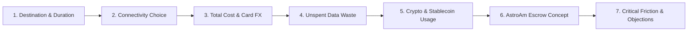

# Customer Discovery Interview Guide — AstroAm

**Project:** AstroAm (Pay-as-you-go travel eSIM in USDC backed by Solana Escrow)  
**Document Purpose:** Customer discovery script and qualitative validation framework for **Colosseum Radar Hackathon** and **Superteam Argentina**.  
**Date:** October 2026  
**Author:** AstroAm Team (`jujuy.dev` / Superteam Argentina)  

---

## 1. Methodology: The 7-Question Discovery Framework

To validate demand, pricing sensitivity, and product friction within a 10-minute conversation (following *The Mom Test* / Lean Customer Discovery principles), the questionnaire is structured into **7 targeted questions**:

### Why 7 Questions?
1. **Time Constraint (10-Minute Rule):** Real travelers answer in 8–12 minutes without survey fatigue.
2. **Covers Key Hackathon Rubric Dimensions:**
   * **Problem & Insight:** Quantifies unspent data loss and currency surcharges.
   * **Argentine Angle:** Measures card exchange rate friction vs. holding self-custodial USDC.
   * **Target Profiles & Channels:** Differentiates Web3-native users (Phantom) from fintech users (Lemon/Belo).
   * **Adoption Barriers:** Uncovers real user hesitations (wallet setup, mobile QR scanning, support expectations).

---

## 2. The 7 Questions

### Question 1 · Trip Context
> **"Where was your last trip abroad (or in the past year), how long did it last, and what was the main reason (vacation, business, shopping)?"**
* **Validation Goal:** Map travel patterns, destinations (Chile, Brazil, Bolivia, US, Europe), and trip duration (essential for calculating the amortized cost of the $1.75 Citrus profile fee).

---

### Question 2 · Connectivity Solution Used
> **"How did you get mobile data during that trip (carrier roaming like Personal/Claro, local physical SIM card bought there, eSIM like Airalo, or hotel Wi-Fi only), and why did you choose that option?"**
* **Validation Goal:** Identify incumbent substitutes and pain points (roaming activation, airport queues, foreign identity registration barriers).

---

### Question 3 · Total Cost & Card Surcharges (The Argentine Angle)
> **"Roughly how much did you spend in total on mobile data, and how did you pay? If you paid with an Argentine credit or debit card, how did bank exchange rates, card spreads, or tax withholdings impact the bill?"**
* **Validation Goal:** Capture realistic financial costs and emotional frustration with bank card conversions and fluctuating exchange rate spreads.

---

### Question 4 · Unspent Balance & Package Expiration (Core Pain)
> **"Did you use up all the data you paid for? Roughly how much was left over, and what happened to that unspent data when you returned home?"**
* **Validation Goal:** Quantify the core pain point that AstroAm solves: fixed packages force travelers to overpay for data that carriers expire without refund.

---

### Question 5 · Stablecoin Holding & Everyday Use
> **"Do you hold or save in stablecoins like USDC or USDT? Which apps or wallets do you use (Lemon, Belo, Binance, Phantom, etc.), and have you ever spent crypto directly on goods or services?"**
* **Validation Goal:** Segment early adopters: Web3-native travelers who already have Phantom/Solflare vs. fintech users who hold stablecoins on custodial apps like Lemon or Belo.

---

### Question 6 · AstroAm Value Proposition
> **"If you could deposit USDC once into a smart contract escrow that charges only the exact megabytes you consume, and automatically returns the remaining balance to your wallet the moment you close the trip, would you use it? What is the most appealing part compared to your current setup?"**
* **Validation Goal:** Test willingness to adopt pay-as-you-go data with automated on-chain escrow refunds vs. prepaid bundles.

---

### Question 7 · Critical Objections & Adoption Blockers
> **"Looking at the flow (depositing USDC on Solana and scanning an eSIM QR code), what is the primary thing that would make you hesitate, mistrust the service, or stop you from using it on a real trip?"**
* **Validation Goal:** Uncover hard user objections: lack of customer support if the eSIM fails, confusion around crypto gas/seed phrases, or difficulties activating an eSIM without Wi-Fi on the road.

---

## 3. Interviewer Guidelines
1. **Never pitch before Question 6:** Listen to their actual past behavior first; do not bias their recollection.
2. **Focus on facts, not hypotheticals:** Ask *"what did you actually do and pay?"* instead of *"would you like a cheaper eSIM?"*.
3. **Capture raw quotes:** Record authentic feedback, doubts, and objections verbatim.
