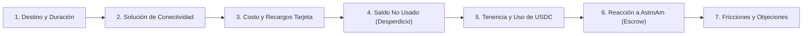

# Guion Metodológico de Entrevistas de Validación — AstroAm

**Proyecto:** AstroAm (Solana Devnet Escrow para eSIM de Viajeros)  
**Objetivo del documento:** Definir el guion de customer discovery y validación de demanda para presentar ante el jurado de **Colosseum Radar Hackathon** y **Superteam Argentina**.  
**Fecha:** Octubre de 2026  
**Responsable:** Equipo AstroAm (`jujuy.dev` / Superteam Argentina)  

---

## 1. Definición Metodológica: ¿Por qué exactamente 7 preguntas?

Para una validación temprana en el contexto de un hackathon de Web3 / Solana, la cantidad óptima de preguntas es **7 preguntas**.

### Justificación de la métrica:
1. **Regla de los 10 minutos (The Mom Test):** Un viajero real dedica entre 8 y 12 minutos a responder. Menos de 5 preguntas deja baches críticos sobre el comportamiento cambiario y Web3; más de 8 preguntas genera fatiga y respuestas superficiales.
2. **Cobertura 360° de la Rúbrica de Evaluación de Colosseum:**
   * **Problema e Insight (P0/P1):** Valida que el dolor del saldo perdido y el recargo impositivo argentino es real, medible y doloroso.
   * **Ángulo Argentino y Números Reales:** Cuantifica la brecha entre pagar en USDC propio vs. pagar con tarjeta argentina (con 60%+ de percepciones e impuestos).
   * **Perfil de Adopción y Distribución (GTM):** Identifica qué wallets usan los viajeros (Phantom vs. Lemon/Belo) y qué canales locales son viables.
   * **Fricción y Objeciones de Producto:** Descubre qué frena al usuario antes de usar la app para alimentar el backlog técnico.

---

## 2. El Cuestionario Oficial de 7 Preguntas

A continuación se detalla cada pregunta, su objetivo estratégico para la presentación del pitch, y qué métrica o dato clave busca extraer.

---

### Pregunta 1 · Contexto del Viaje
> **"¿A dónde fue tu último viaje al exterior (o en el último año), cuánto tiempo duró y cuál fue el motivo (vacaciones, trabajo, compras)?"**

* **Objetivo de validación:** Contextualizar el perfil del viajero, duración promedio del viaje (clave para calcular el impacto del costo fijo de $1.75 por eSIM de Citrus) y destinos más frecuentes de la región (Brasil, Chile, Bolivia, EE.UU., Europa).
* **Métrica a registrar:** Destino, cantidad de días, perfil de consumo (intensivo o moderado).

---

### Pregunta 2 · Solución de Conectividad Actual
> **"¿Cómo resolviste la conexión a internet/datos móviles durante ese viaje (roaming de Claro/Personal/Movistar, chip físico local comprado en destino, eSIM como Airalo/Holafly, o solo Wi-Fi) y por qué elegiste esa opción?"**

* **Objetivo de validación:** Mapear los sustitutos y competidores directos, así como la fricción de adquisición (colas en aduanas/aeropuertos, barreras idiomáticas, requisitos de DNI/CPF local).
* **Métrica a registrar:** Tipo de alternativa utilizada y motivo principal de elección (comodidad, precio, desconocimiento).

---

### Pregunta 3 · Costo Total y Recargos Cambiarios (El Ángulo Argentino)
> **"¿Cuánto gastaste aproximadamente en total por esos datos y con qué medio pagaste? Si pagaste con tarjeta argentina de crédito o débito, ¿cuánto te impactó el recargo impositivo (dólar tarjeta / percepciones)?"**

* **Objetivo de validación:** Obtener números reales del mercado argentino. Validar la hipótesis de que el recargo impositivo (percepciones AFIP/ARCA, dólar tarjeta) se percibe como una penalización injusta y encarece el servicio entre un 50% y un 60% sobre el precio de lista.
* **Métrica a registrar:** Gasto en USD/ARS y percepción subjetiva del sobrecosto financiero impositivo.

---

### Pregunta 4 · Desperdicio de Saldo y Paquetes Cerrados (El Dolor Central)
> **"¿Llegaste a consumir todos los gigas o el paquete que pagaste? Si te sobraron datos, ¿qué porcentaje aproximado fue y qué pasó con ese saldo al volver a casa?"**

* **Objetivo de validación:** Validar la hipótesis fundacional de AstroAm: **los paquetes cerrados obligan a pagar por datos que no se usan**. Demostrar empíricamente qué porcentaje del dinero del viajero queda confiscado por los operadores tradicionales o apps incumbentes.
* **Métrica a registrar:** % de datos no consumidos (típicamente entre 30% y 60%) y destino del saldo (vencido/perdido).

---

### Pregunta 5 · Familiaridad y Tenencia de Cripto / Stablecoins
> **"¿Ahorrás o manejás actualmente stablecoins como USDC o USDT? ¿En qué plataformas o billeteras las tenés guardadas (Lemon, Belo, Ripio, Binance, Phantom, etc.) y alguna vez compraste algo o pagaste un servicio directamente con cripto?"**

* **Objetivo de validación:** Identificar la brecha de distribución y tooling. Determinar si nuestro primer segmento objetivo (early adopters) ya tiene Phantom/Solflare (comunidad `jujuy.dev` / Superteam) o si están en plataformas locales (Lemon, Belo) que requerirán integración futura o Solana Pay.
* **Métrica a registrar:** Billetera/Exchange principal, tenencia de stablecoins (Sí/No), experiencia previa de pago Web3.

---

### Pregunta 6 · Validación de la Propuesta de Valor de AstroAm
> **"Si pudieras depositar USDC una sola vez en un contrato inteligente que solo te cobra los megabytes exactos que vas usando en el viaje, y te devuelve automáticamente todo el saldo sobrante a tu propia billetera apenas terminás la sesión o volvés a Argentina, ¿lo usarías? ¿Qué te parece lo más atractivo frente a lo que usás hoy?"**

* **Objetivo de validación:** Medir la tracción y el entendimiento del valor diferencial de AstroAm:
  1. No hay saldo cautivo (diferenciación frente a Roamless).
  2. No hay paquetes cerrados sin reembolso (diferenciación frente a Airalo y Bitrefill).
  3. No hay recargos de tarjeta argentina (diferenciación frente a operadores tradicionales).
* **Métrica a registrar:** Nivel de interés (1 a 5), factor más valorado (reembolso automático, ahorro impositivo, pago por megabyte exacto).

---

### Pregunta 7 · Fricciones, Barreras de Entrada y Objeciones Reales
> **"Mirando la app y el flujo actual (depósito con wallet en Solana y escaneo de código QR para instalar la eSIM), ¿qué es lo primero que te frenaría, te generaría dudas o te resultaría incómodo para usarlo en un viaje real?"**

* **Objetivo de validación:** Descubrir objeciones reales de usuario (The Mom Test). Identificar fricciones técnicas (gestión de gas en SOL, wallets no custodiales, instalación previa del QR sin internet en viaje, atención al cliente ante falta de señal).
* **Métrica a registrar:** Principal objeción categorizada (Soporte técnico, Fricción Web3/Wallet, Conectividad/Cobertura, Confianza en el contrato).

---

## 3. Protocolo de Ejecución para el Entrevistador

1. **No vender la idea al inicio:** Comenzar escuchando la experiencia pasada del viajero (preguntas 1 a 4) antes de mencionar AstroAm o Web3.
2. **Indagar sobre comportamientos pasados, no intenciones hipotéticas:** Preguntar *"cuánto pagaste y qué hiciste"* en vez de *"cuánto pagarías"*.
3. **Mostrar el prototipo en 60 segundos:** En la pregunta 6 y 7, mostrar la pantalla de la app (`Mission Setup` y `Escrow Deposit`) para obtener una reacción visual concreta.
4. **Registrar citas textuales exactas:** Cada entrevista debe dejar al menos una frase textual que resuma el dolor o la reacción del usuario para incorporar al pitch y al archivo `docs/validation.md`.
