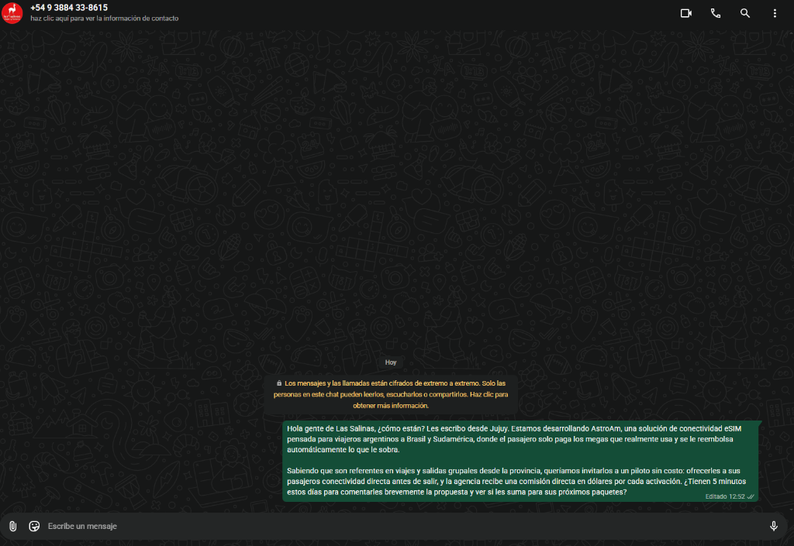
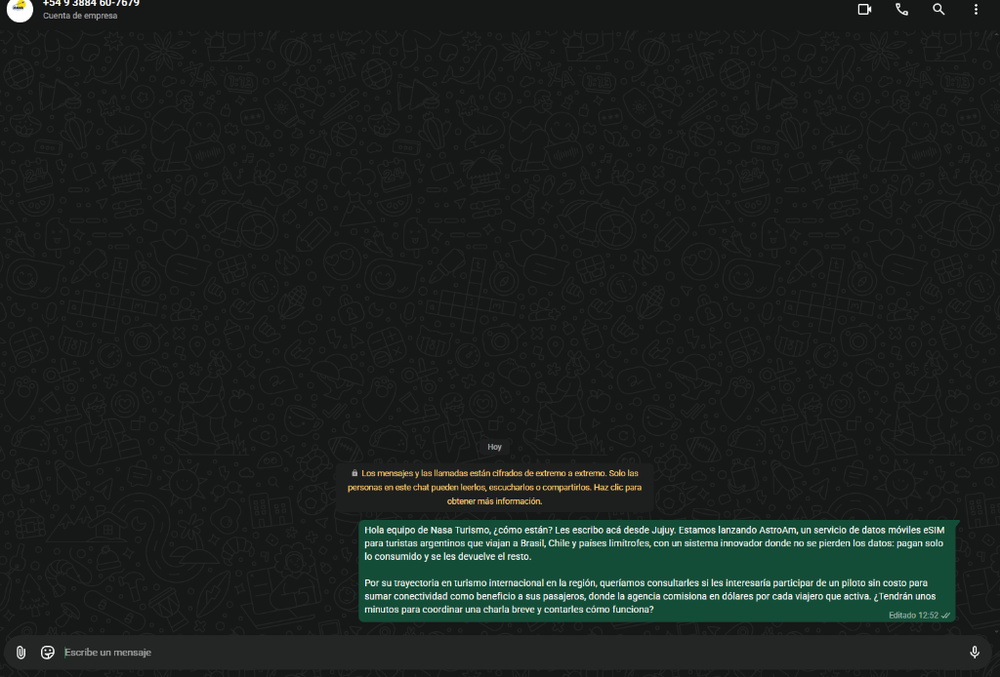

# Traveler Validation & Discovery

**Date:** 2026-10-10  
**Status:** Completed (10 Argentine travelers interviewed from Jujuy / NOA).  
**Interviewer:** Daniel  

---

## 1. Interview Protocol & Questions

Conversations were conducted with travelers from Jujuy. Nine of the ten trips were to neighboring countries (Bolivia, Chile, Brazil); one was to the Dominican Republic. The product was not sold during the questions. The 4 questions asked:
1. **Destination & Connection:** Where did you travel, for how long, and how did you connect to mobile data?
2. **Spend & Unused Gigabytes:** How much did you pay for connectivity, and how much unused data was wasted or unspent?
3. **Crypto / Digital Dollars:** Do you hold USDC, USDT, or digital dollars, and in what wallet/app (Lemon, Belo, Binance, Phantom, etc.)?
4. **Product Feedback & Perception:** What is your opinion on AstroAm's model (pay only for used megabytes in digital dollars with automatic escrow refund)?

---

## 2. Interview Logs (10 Argentine Travelers)

| # | Traveler Profile | Destination & Length | How they connected | Cost & Unused Data | USDC / Crypto Wallet | Quote (original Spanish, then English) |
|---|------------------|----------------------|--------------------|-------------------|----------------------|----------------------------|
| 1 | Andrés Salinas (29, Jujuy) | Bolivia | No roaming; had to search for local businesses with Wi-Fi. | Spent $0 on packs because carrier roaming rates were prohibitively expensive. | No | *"Es un lindo plan con perspectiva."* "It's a nice plan with a future." (Appreciates an affordable on-demand alternative to carrier roaming rates.) |
| 2 | Facundo Vidal (38, Jujuy) | Brazil (10 days) | Bought a virtual chip / eSIM. | Paid ~$15,000 ARS. Lost unused portion of fixed package. | No | *"Está muy bueno."* "It's really good." (Liked paying only for what is used instead of a fixed pack.) |
| 3 | Gabriel Chillian (28, Jujuy) | Bolivia (1 week) | Carrier roaming initially, then bought local physical SIM in Bolivia (difficult paperwork). | ~15 BOB for local SIM. Barely used data because hotel had Wi-Fi; wasted leftover megabytes. | No | *"Con el proyecto se puede llegar a viajar seguro, porque si no tenés cobertura y estás en la ruta es muy inseguro para el viajero."* "With this you can travel safely, because being on the road with no coverage is very unsafe for a traveler." |
| 4 | Leonardo Caucota (24, Jujuy) | Bolivia (2 weeks) | Dependent entirely on public/hotel Wi-Fi. | $0 on mobile packs (chose disconnection over high roaming costs). | No | Paraphrased by the interviewer, not verbatim: likes the idea. (Sees value for travelers who skip roaming because of the cost.) |
| 5 | Agustín Torrico (24, Jujuy) | Bolivia (1 day) | Connected to Wi-Fi whenever possible. | $0 spent. | **Yes** (holds crypto/digital dollars in Lemon) | Paraphrased by the interviewer, not verbatim: finds the idea innovative and cheap. |
| 6 | Fiorela Campos (21, Jujuy) | Chile (2 weeks) | Had to purchase a Chilean local physical SIM with local ID/number. | ~$5,000 ARS. | **Yes** (holds crypto/digital dollars in Lemon) | *"Es algo nuevo e ingenioso."* "It's something new and clever." (Praised skipping the registration a local SIM needs.) |
| 7 | Participant 7 (under 18, Jujuy; name withheld) | Dominican Republic (19 days) | Connected exclusively via hotel Wi-Fi. | $0 spent. | No | *"Público amplio, es apto para todo público."* "A broad audience; it works for anyone." |
| 8 | Matías Ramos (27, Jujuy) | Brazil (Florianópolis, 8 days) | Roaming pack from Argentine carrier. | ~$18,000 ARS for 5 GB pack. Returned home with ~3 GB unused. | **Yes** (holds USDT/USDC in Lemon & Binance) | *"Compré 5 GB por las dudas y me sobraron más de 3 GB; da bronca regalarle esa plata a la telefónica."* "I bought 5 GB just in case and had more than 3 GB left over; it's infuriating to give that money to the carrier." |
| 9 | Camila Soto (25, Jujuy) | Chile (Iquique, 5 days) | Physical chip bought at border crossing. | ~$6,500 ARS. Spent 2 hours finding a shop and configuring APN. | No (interested in digital dollars) | *"Tener internet apenas cruzas la frontera sin tener que hacer fila para comprar un chip físico te ahorra medio día de viaje."* "Having internet as soon as you cross the border, without queuing to buy a physical SIM, saves you half a day of the trip." |
| 10 | Julián Tolaba (31, Jujuy) | Bolivia & Chile (10 days) | Bought roaming for emergencies only; relied on cafe Wi-Fi. | ~$12,000 ARS. | **Yes** (holds USDC in Belo) | *"Si puedo fondear con Lemon o Belo y que me devuelvan lo que no consumí, lo uso en cada viaje al norte o a Chile."* "If I can fund it from Lemon or Belo and get back what I didn't use, I'll use it on every trip up north or to Chile." |

---

## 3. What the interviews show

Counts read from the table above:

- **5 of 10** avoided paying for mobile data and relied mostly on Wi-Fi (#1, #4, #5, #7, #10).
- **3 of 10** bought a fixed pack or a local SIM and left data unused (#2, #3, #8). #8 used under 2 of 5 GB, about 60% unused.
- **2 of 10** bought a local physical SIM at or after the border (#6, #9), with ID registration or a two-hour detour.
- **4 of 10** already hold digital dollars, in Lemon, Belo, or Binance (#5, #6, #8, #10). None mentioned a Solana wallet.

Evidence line for the pitch:
> **"We interviewed 10 travelers from Jujuy: half skip mobile data abroad and hunt for Wi-Fi, those who buy a pack leave data unused, and 4 of 10 already hold digital dollars."**

### Core Insights:
1. **Avoiding roaming:** Most travelers from Jujuy going to Bolivia or Chile avoid carrier packs because of the price, and rely on Wi-Fi or on a local physical SIM that takes paperwork.
2. **Leftover waste:** Travelers who buy fixed packs (#2, #3, #8) leave gigabytes unused, up to about 60% in #8's case.
3. **Digital dollars are held in consumer apps:** The 4 who hold digital dollars use Lemon, Belo, or Binance, not a self-custody Solana wallet. Onboarding from those apps to a Solana deposit is an open question for the pilot.

### Limits
- One interviewer and travelers from one province (Jujuy). This is a first signal, not a representative sample.
- Answers about cost are from memory.
- No one paid or deposited. Willingness to pay in USDC is stated, not measured.

---

## 4. Distribution Channel / Agency Outreach Log

**Goal:** Reach out to local travel agencies in Jujuy / NOA operating outbound travel to Brazil, Chile, and neighboring countries to test interest in a pilot referral model.

| # | Agency Partner | Location & Contact | Date Sent | Channel | Status & Response | Evidence |
|---|----------------|--------------------|-----------|---------|-------------------|----------|
| 1 | **Las Salinas Viajes y Turismo** | San Salvador de Jujuy +54 9 388 433-8615 | 2026-10-10 | WhatsApp Business | Message delivered (two checkmarks). Awaiting response. |  |
| 2 | **Nasa Turismo** (Norte Argentino S.A.) | San Salvador de Jujuy +54 9 388 460-7679 | 2026-10-10 | WhatsApp Business | Message delivered (two checkmarks). Awaiting response. |  |

### Verbatim Outreach Pitch Sent:
> *"Hola gente de Las Salinas / Nasa Turismo, ¿cómo están? Les escribo desde Jujuy. Estamos desarrollando AstroAm, una solución de conectividad eSIM pensada para viajeros argentinos a Brasil y Sudamérica, donde el pasajero solo paga los megas que realmente usa y se le reembolsa automáticamente lo que le sobra. Queríamos invitarlos a un piloto sin costo: ofrecerles a sus pasajeros conectividad directa antes de salir, y la agencia recibe una comisión directa en dólares por cada activación..."*

English translation:
> "Hi Las Salinas / Nasa Turismo team, how are you? I'm writing from Jujuy. We're building AstroAm, an eSIM connectivity solution for Argentine travelers going to Brazil and South America, where the passenger pays only for the megabytes they actually use and what is left over is refunded automatically. We'd like to invite you to a free pilot: offer your passengers connectivity before they leave, and the agency gets a commission in dollars for each activation..."

The referral commission in this message is a proposal. Its amount is not set and the automatic payment is not built (see [go-to-market.md](go-to-market.md)).

